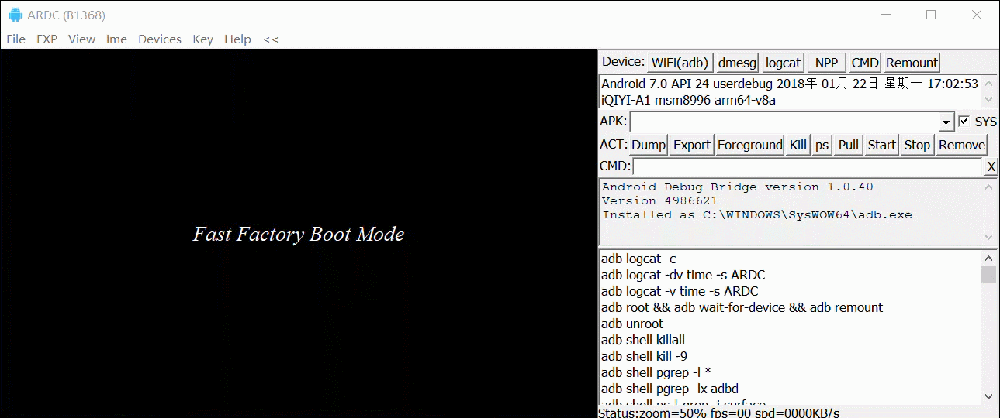

 # 开机模式

 ## 介绍
 高通方案的Android设备主要有以下几种开机模式:
 - Android
 - EDL
 - Fastboot
 - Recovery
 - FFBM

#<Font color=red size=1>
|开机模式	|屏幕显示	|冷启动	|热启动	|按键退出	|命令退出|
|-|-|-|-|-|-|
|Android/Normal|Android界面|按Power键|adb reboot|手机短按，VR长按Power键|adb shell reboot -p(关机)|
|Recovery/OTA/卡刷|Recovery界面|按住OK键(Vol+)，再按Power键|adb reboot recovery|长按Power键重启	|adb reboot|
|Fastboot/线刷|Fastboot界面|按住BACK键(Vol-)，再按Power键|adb reboot bootloader|长按Power键重启	|fastboot reboot/fastboot continue(resuming boot)|
|FFBM/Fast Factory/厂测/半开机|显示测试列表|misc分区头部为ffbm时，按Power键|misc分区头部为ffbm时，adb reboot|长按Power键重启 依然进入FFBM|唯一退出方式擦除misc分区|
|EDL/紧急下载/9008/砖头/裸板|无显示,黑屏|同时按住OK键(Vol+)和BACK键(Vol-)，再按Power键|adb reboot edl /<br/>fastboot reboot emergency|长按Power键重启|无|
#</Font>

- Recovery
恢复模式是一个小型Linux操作系统，可以用来对手机恢复出厂设置，或者使用供应商image对设备进行更新。

所有的设备都存在Recovery， 但并非所有设备都提供Fastboot。
- FFBM
主要是工厂生产测试使用。在该模式下，Android手机一般可以通过触屏在FFBM界面的Reboot菜单中选择重启进入Android。VR头显没有触屏，且FFBM界面是2D的，无法正常查看和操控，只能连接电脑通过QFIL工具擦除misc分区才能恢复。system及data分区可以不动，单独擦除misc分区即可，这样可避免用户数据丢失，具体步骤可参考《VR一体机如何退出FFBM(QFIL)》。进入FFBM的原因是misc分区被写入了特殊内容ffbm。一般fastboot界面有菜单选项可以选择进入该模式。这也是用户有可能误操作导致进入FFBM模式的一个途径。
- EDL
就是俗称的砖头模式，按POWER键后，屏幕依然是黑屏，没有任何显示，用USB线连接电脑，在设备管理器中有QDloader 9008的COM端口(需安装驱动[Qualcomm_Drivers_QDLoader.zip](https://gsmusbdrivers.com/download/qualcomm-hs-usb-qdloader-9008-driver-64-bit-windows/))。此种模式只能通过高通的刷机工具QFIL重新烧录固件才可恢复。在做恢复时也可以先选择局部烧录，如==先单独烧录xbl和abl等分区，看是否有机会让系统恢复正常启动，从而保全用户数据==

## 如何退出FFBM
Fast Factory Boot Mode(FFBM)是一种半开机的模式，它的主要目的是方便工厂测试，提高生产效率。正常情况下终端用户是不会碰到的。该模式具体表现为屏幕显示既不是开机动画也不是VR界面，通过USB线连接上电脑后adb可以正常识别并可输入命令，但安卓投屏助手(ARDC)一直显示等待系统启动完成。查看内核启动命令行，如下：
```sched_enable_hmp=1 sched_enable_power_aware=1 console=ttyHSL0,115200,n8 androidboot.console=ttyHSL0 androidboot.hardware=qcom user_debug=31 msm_rtb.filter=0x237 ehci-hcd.park=3 lpm_levels.sleep_disabled=1 cma=32M@0-0xffffffff androidboot.bootdevice=624000.ufshc androidboot.verifiedbootstate=orange androidboot.veritymode=enforcing androidboot.keymaster=1 androidboot.serialno=7e9ca27c androidboot.mode=ffbm-00 quiet androidboot.baseband=apq```

可以看到androidboot.mode=ffbm-00，同时[ro.bootmode]为[ffbm-00]，以此可确认VR一体机确实进入了Fast Factory Boot Mode。
进入该模式后，即使强制重启机器也无法恢复。手机如果进入该模式，可点击触屏操作，选择重启进入Android即可恢复。而VR一体机没有触屏，只能通过PC操作。由于FFBM是一种半开机的模式，此时安卓投屏助手或Vysor等远程投屏工具都无法正常使用，只能通过fastboot命令擦除misc分区来恢复，具体步骤如下图所示。



其中涉及的命令如下：

```shell
adb reboot bootloader
fastboot erase misc
fastboot reboot
```

TODO:擦除misc，还能进入android吗？

有时候命令不好使，只能使用QFIL了，输入`adb reboot edl`进入，EDL模式.